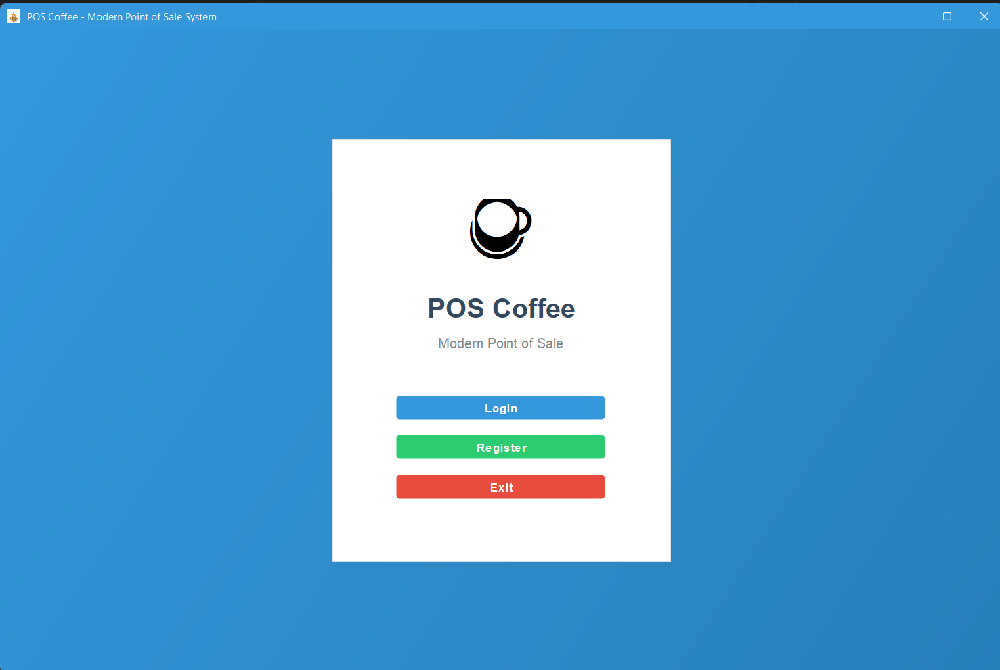
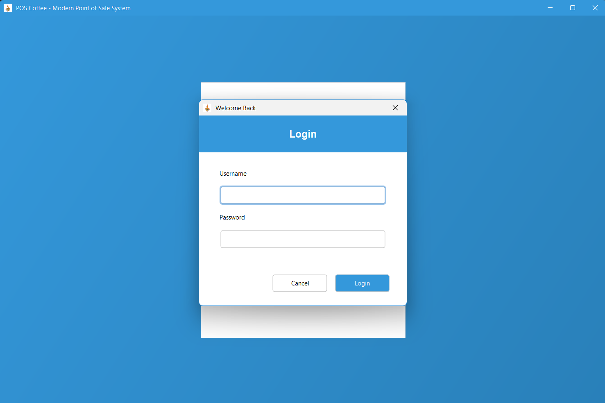
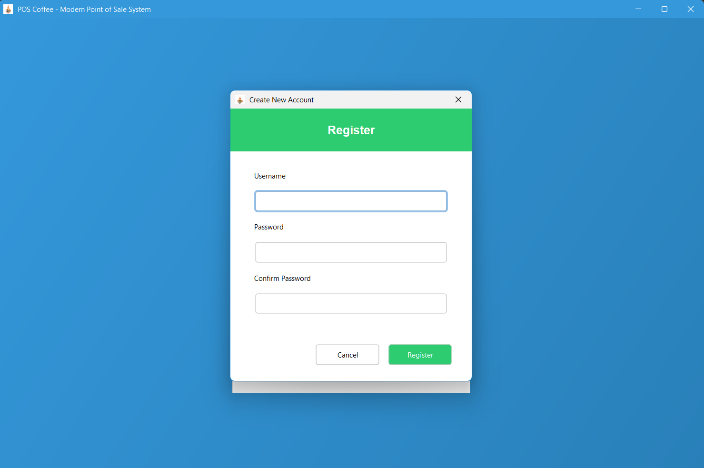
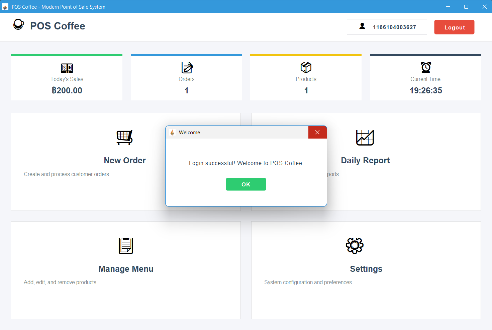
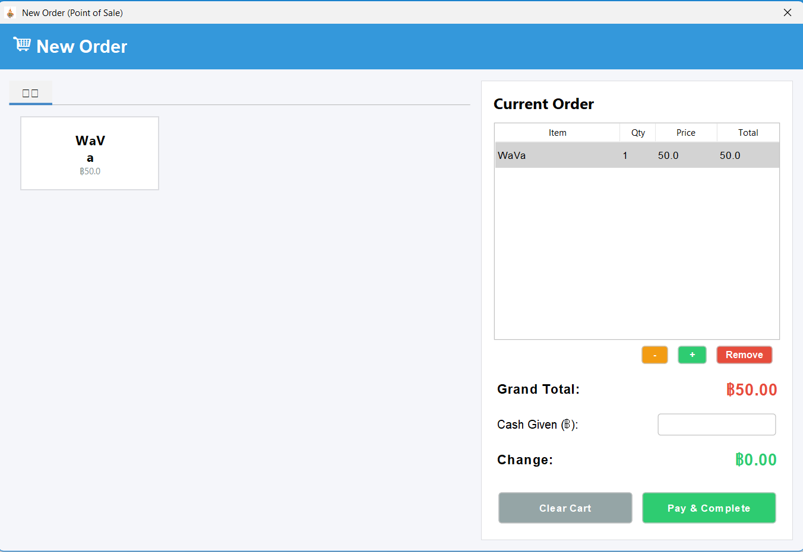
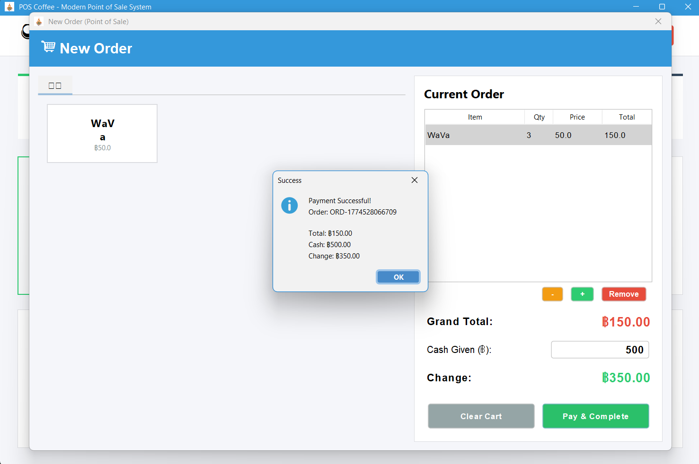
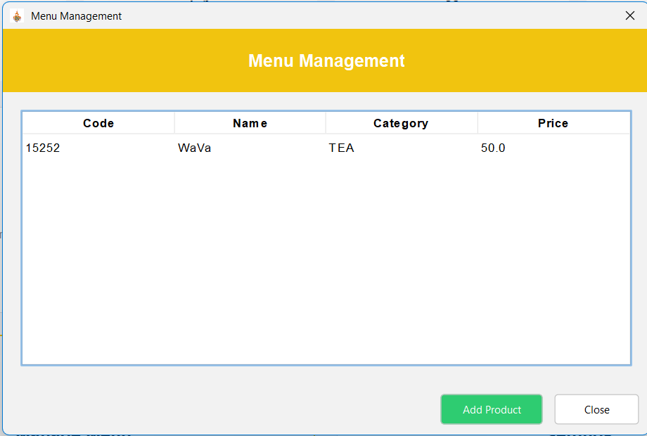
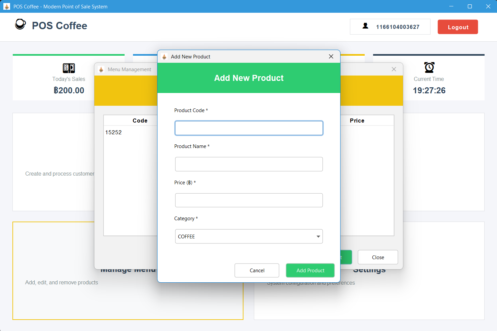
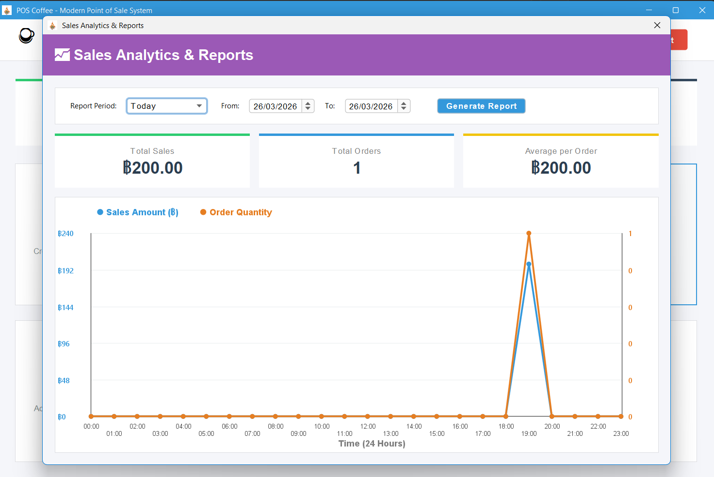

# ☕ POS Coffee - Modern Point of Sale System


โปรเจกต์มินิแอปพลิเคชันระบบจัดการร้านกาแฟ (Point of Sale) พัฒนาด้วย **Java (Swing)** จัดทำขึ้นเพื่อเป็นโปรเจกต์ (Mini Project) โดยเน้นสถาปัตยกรรมการออกแบบที่สะอาด เป็นระเบียบ (Layered Design / MVC) และ User Interface ที่ดูทันสมัยน่าใช้งาน 

## ✨ Features (ความสามารถของระบบ)

- 🔒 **Authentication:** ระบบลงทะเบียน (Register) และเข้าสู่ระบบ (Login)
- 📊 **Dashboard:** แผงควบคุมหน้าแรก แสดงสถิติยอดขายวันนี้, จำนวนออเดอร์ พร้อมนาฬิกาบอกเวลาแบบ Real-time
- 🛒 **Point of Sale (POS):** หน้าต่างรับออเดอร์สุดทันสมัย
  - จัดโครงสร้างปุ่มสินค้าตามหมวดหมู่ (Coffee, Tea, Milk, Bakery, Food ฯลฯ)
  - ระบบจัดการตะกร้าสินค้า (กดที่ตารางตะกร้าด้านขวาเพื่อ เพิ่ม/ลด/ลบรายการ)
  - ระบบคิดเงิน ใส่จำนวนเงินรับเข้า คำนวณเงินทอนอัตโนมัติ 
- 📋 **Menu Management:** จัดการรายการสินค้าในร้าน (เพิ่มสินค้า/ระบุราคา/หมวดหมู่ และแสดงรายการสินค้าทั้งหมด)
- 📈 **Sales Analytics & Reports:** ระบบข้อมูลสรุปยอดขายด้วยกราฟ
  - สร้างกราฟเส้น (Line Chart) แสดงความสัมพันธ์ระหว่าง "ยอดขายรวม" และ "ปริมาณออเดอร์" 
  - เลือกดูรายงานแบบด่วน: วันนี้ (พล็อตระบุชั่วโมง), สัปดาห์นี้, เดือนนี้, ปีนี้
  - ระบบ Custom Range Date เลือกระบุวันที่ต้องการดูรายงานได้อย่างอิสระ

## 🛠️ Tech Stack (เทคโนโลยีที่ใช้)

- **Language:** Java 
- **GUI Framework:** Java Swing (Pure Swing UI / Custom Components Design)
- **Database:** SQLite (เชื่อมต่อผ่าน JDBC driver)
- **Architecture System:** แบ่งเลเยอร์ชัดเจน (Model - Repository - Service - UI)

## 📂 Project Structure (โครงสร้างโค้ดส่วนสำคัญ)

```text
src/
 ├── db/            # คลาสสำหรับเปิดการเชื่อมต่อกับฐานข้อมูล (DatabaseManager)
 ├── model/         # โมเดลออบเจกต์ (User, Product, Order, SalesRecord, OrderItem ฯลฯ)
 ├── repository/    # จัดการเชื่อมต่อฐานข้อมูลและ Query ควบคุมตารางต่างๆ
 ├── service/       # ส่วนควบคุมลอจิกเบื้องหลัง (AuthService, ReportService)
 ├── ui/            # ส่วนหน้าจอทั้งหมด (POSAppFrame, Dialogs แบบต่างๆ)
 └── UIMain.java    # คลาสหลัก (Entry Point) สำหรับเริ่มต้นโปรแกรม
```

## 🚀 How to Run (วิธีติดตั้งและลองใช้งาน)

1. **Clone repository:**
   ```bash
   git clone https://github.com/watggwp/Project_OOSE.git
   ```
2. **Setup Dependencies:** 
   - โปรเจกต์จำเป็นต้องใช้ Database Driver `sqlite-jdbc.jar`
   - แอดไฟล์ .jar ลงใน **Libraries (Build Path)** ภายใน IDE ของคุณ (เช่น Eclipse, IntelliJ หรือ VSCode)
3. **Compile & Run:** 
   - รันไฟล์ `src/UIMain.java`
4. การรันครั้งแรก ระบบจะทำการสร้างฐานข้อมูลชื่อ `poscoffee.db` พร้อมสร้าง Table และเซ็ตสินค้าเมนูเริ่มต้น (Mock Data) ให้โดยอัตโนมัติ

## 📸 Screenshots (ภาพตัวอย่างแอปพลิเคชัน)

### Main Dashboard


### Authentication & Welcome







### Point of Sale (POS) & Checkout




### Menu Management




### Sales Analytics & Reports
